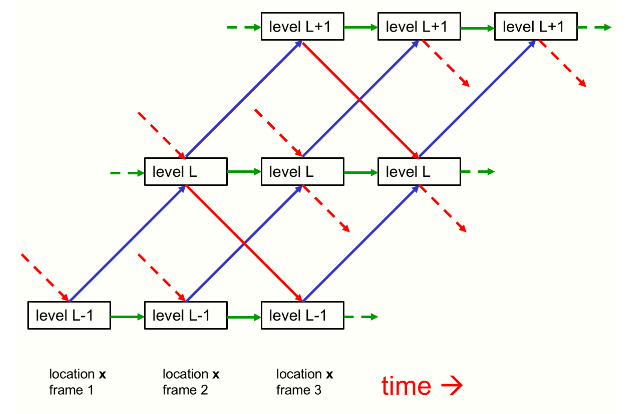
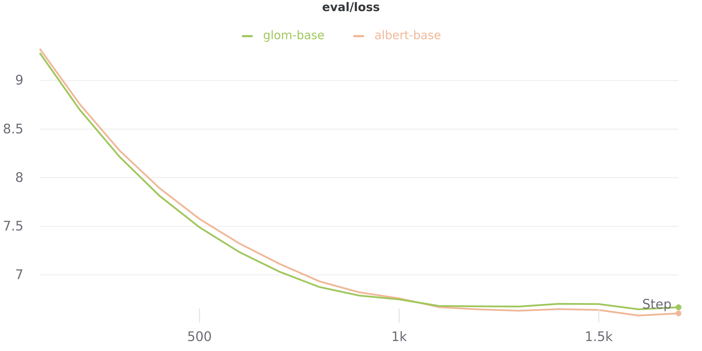
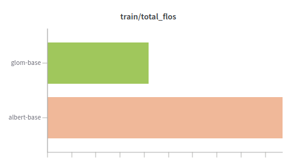
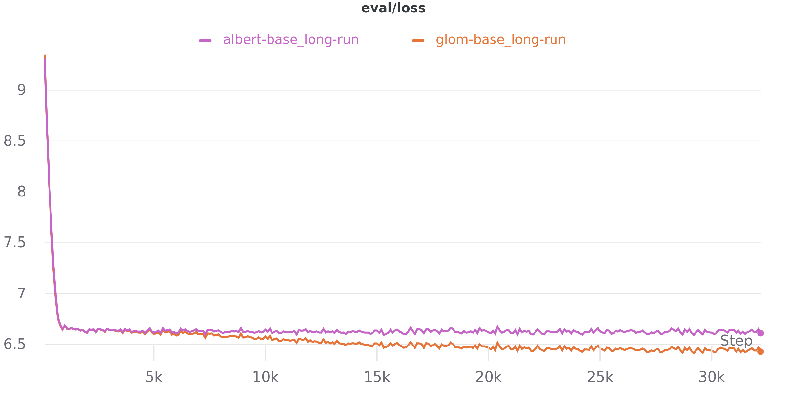

# GLOM

This is a simple implementation of the GLOM model ([paper](https://arxiv.org/pdf/2102.12627.pdf)) for the **textual** domain. It heavily builds on the [hugginface implementation](https://github.com/huggingface/transformers/tree/master/src/transformers/models/albert) of the ALBERT model ([paper](https://arxiv.org/abs/1909.11942)).



## Approach
* use t **transformer layers** (t=number of **GLOM time steps** you want to model)
* use L **attention heads** (L=number of **GLOM levels** you want to model)
* apply these small modifications to the ALBERT model:
	1) remove the linear projections for query, key, value; just pass through `[(d/L)*i..(d/L)*(i+1)]` to the i'th head
	2) modify/constrain the dense layer that follows the attention in a way that each partition `[(d/L)*i..(d/L)*(i+1)]` of its output is only constructed by the output of the (i-1)-th, the i-th, and the (i+1)-th head (this models the access to the lower and higher GLOM levels)
	3) remove the skip connection(s) and the MLP that sits on top of the attention layer
	4) for masked language model training: project the input token embedding only to `[0..(d/L)]` (the first level). Also, only take these dimensions from the final hidden state to predict the masked token. All other dimensions get a (position independent, but level dependent) bias as zero-timestep-input.


## Getting Started

1) install requirements from requirements.txt

2) train a model
```
run_hf_mlm.py \
--config configs/glom/config.json \
--model_type glom \
--tokenizer albert-base-v2 \
--dataset_name wikitext \
--dataset_config_name wikitext-103-raw-v1 \
--do_train \
--max_examples_train 100000 \
--num_train_epochs 1 \
--do_eval \
--evaluation_strategy steps \
--logging_steps 100 \
--output_dir train/test-mlm \
--save_total_limit 1 \
--overwrite_output_dir
```
perplexity after **6 minutes** of training: 795.4487658472486

For comparison, train a similar (has a bit more parameters) ALBERT model 
```
run_hf_mlm.py \
--config albert-base-v2 \
--tokenizer albert-base-v2 \
--dataset_name wikitext \
--dataset_config_name wikitext-103-raw-v1 \
--do_train \
--max_examples_train 100000 \
--num_train_epochs 1 \
--do_eval \
--evaluation_strategy steps \
--logging_steps 100 \
--output_dir train/test-mlm \
--save_total_limit 1 \
--overwrite_output_dir
```
perplexity after **12 minutes** of training (same amount of data as above): 738.9137609576597 



Comparison of executed **floating point operations**:  



Results for runs with same parameters as above, but on the whole dataset (**w/o** parameter `--max_examples_train 100000`):  
* GLOM:		perplexity = 623.4778409995062 (time=2:26:08)
* ALBERT: 	perplexity = 746.7975879565178 (time=3:55:32) (NOTE: This is worse then the short run, have to do hyperparameter search to get valid scores.)


